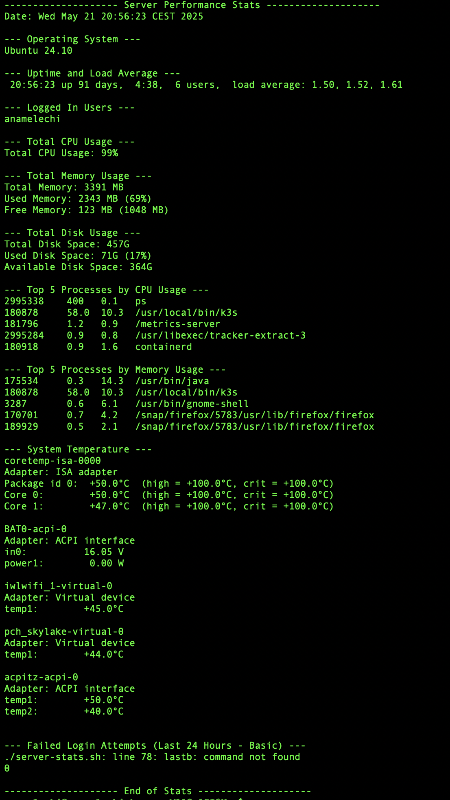

# server-stats.sh - Basic Server Performance Stats Analysis Script

This script is a simple shell script designed to analyze basic server performance statistics on a Linux system. It provides a quick overview of the server's resource usage and top processes.

## Features

This script gathers and displays the following information:

* **Total CPU usage:** Shows the overall CPU utilization of the server.
* **Total memory usage:** Displays the total, used, and free memory, along with the percentage of memory used.
* **Total disk usage:** Shows the total, used, and available disk space for the root partition, along with the percentage of disk space used.
* **Top 5 processes by CPU usage:** Lists the top 5 processes consuming the most CPU resources.
* **Top 5 processes by memory usage:** Lists the top 5 processes consuming the most memory resources.

### Stretch Goals (Optional)

The script also includes the following optional statistics:

* **Operating System Version:** Identifies the Linux distribution and version.
* **Uptime:** Shows how long the server has been running.
* **Load Average:** Displays the system load average over the past 1, 5, and 15 minutes.
* **Logged In Users:** Lists the currently logged-in users.
* **Failed Login Attempts (Basic):** Provides a count of failed login attempts in the last 24 hours (this is a basic implementation).

## Prerequisites

* A Linux-based operating system.
* Basic shell utilities like `bash`, `date`, `vmstat`, `free`, `df`, `ps`, `head`, `awk`, `sort`, `uptime`, `who`, `lastb`, and `wc`. These are commonly available on most Linux distributions.

## Installation

No installation is required. Simply download the `server-stats.sh` script to your server.

## Usage

1.  **Download the script:**
    ```bash
    wget https://github.com/Anamelechi/server-stats.git
    ```
    or
    ```bash
    git clone https://github.com/Anamelechi/server-stats.git
    cd server-stats
    ```

2.  **Make the script executable:**
    ```bash
    chmod +x server-stats.sh
    ```

3.  **Run the script:**
    ```bash
    ./server-stats.sh
    ```

    This will print the server performance statistics to your terminal.

4.  **Optional: Redirect output to a file:**
    ```bash
    ./server-stats.sh > server_stats.log
    ```

## Output Example

## Contributing

Feel free to contribute to this project by suggesting improvements, adding more stats, or fixing any issues. You can submit pull requests or open issues on GitHub.

## License

[MIT License](LICENSE)
